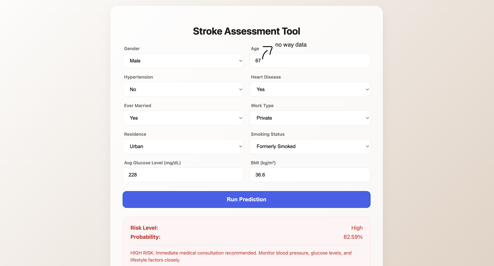

# Stroke Prediction

ML stroke prediction project based on medical and lifestyle factors.I used Flask for backend with model training and joblib for model saving.Also Web Application is available for predicts.

## Demo



## Getting Started

### 1.Installation
Install the necessary dependencies:
```bash
pip install pandas numpy scikit-learn imbalanced-learn xgboost flask joblib
```

### 2. Training the Models
To train the model and save the necessary artifacts (scalers, encoders, and the best,model):
```bash
python3 main.py
```

### 3. Running the Web Application
To launch the interactive web interface:
```bash
python3 app.py
```
Then visit: [http://127.0.0.1:5001](http://127.0.0.1:5001)

## Project Structure
- `app.py`: Flask web server.
- `main.py`: Model training and artifact generation script.
- `src/`: Core logic for preprocessing, training, and prediction.
- `templates/`: HTML frontend files.
- `models/`: Saved model artifacts (.joblib files).
- `data/`: Dataset storage(Kaggle).
